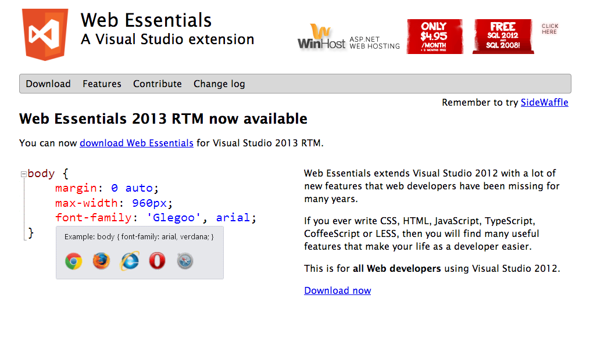
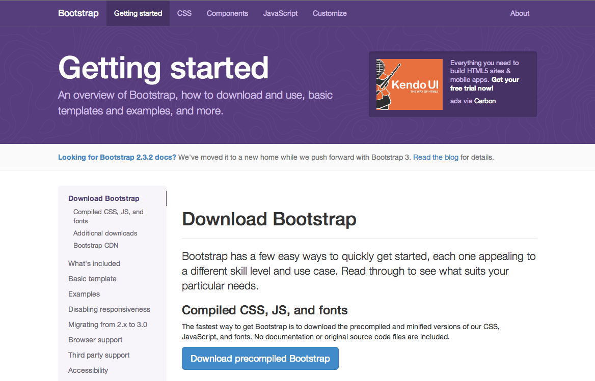
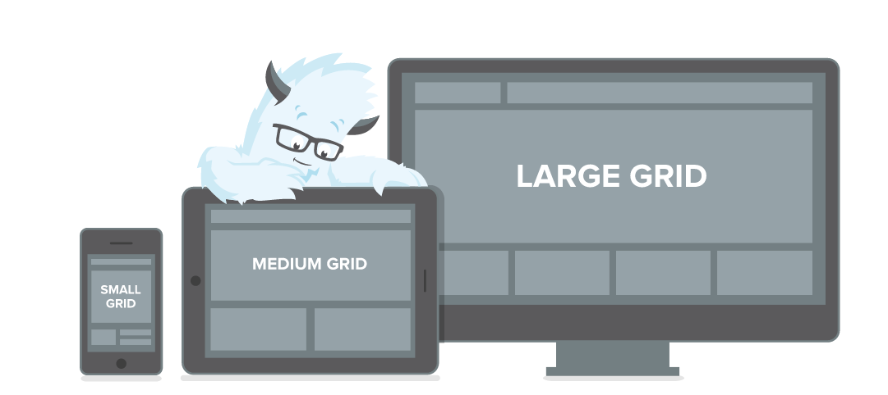

# developing with arcgis online 
{: #Cover}
[Nils Rydh](http://twitter.com/pilsna) 

##  
{:.cover .w}
<!-- photo from developers.arcgis.com -->

## **goals**
 
## knowledge exchange
{:.cover .h .picture}

<!-- http://www.flickr.com/photos/jagermo/11066936233/ -->

## hands-on 
{:.cover .h .picture}

<!-- http://www.flickr.com/photos/34402227@N03/9080921551 -->

## solve something
{:.cover .h .picture}

<!-- http://www.flickr.com/photos/27109510@N00/8803626/ -->

## input from sales
- data analysis
- visualization
- routing - to be qualified

## enough
{:.cover .w .picture}

<!-- http://www.flickr.com/photos/48116201@N08/4463850560 -->

## tools
- sublime text 
- webstorm

## 
{:.cover .w}

## github
- version control system (git)

//TODO: install github for windows or git 

## 
{:.cover .w}

## not just the code
- issue tracking
- wiki
- publishing: maps & web content

## [geojson](https://github.com/Neogeografen/beachnumbers/blob/master/beachnumber.geojson) 
{:.cover .h .picture}

## gists
Gist - a simple way of sharing snippets

//TODO: create a gist and add some geojson or other content

## publish html
Bl.ocks.org 

## [http://github.com/esri](http://github.com/esri) 

//TODO: clone a project on github and have a look at it 

## **mobile first**

## The old approach 
- ... Check the user agent  
- ... Redirect to a mobile view 
- ... Example: [matas](http://matas.dk), AGO template

## The new approach 
- Fluid/responsive layout that is based on size relative to the viewport. 
- (definition of viewport) 
- [developers.arcgis.com](http://developers.arcgis.com)

## html5

    <!DOCTYPE html>
    <html>
        <head>
            <meta charset="utf-8">
            <meta name="viewport" 
                  content="initial-scale=1, 
                      maximum-scale=1,
                      user-scalable=no">
        </head>
        <body></body>
    </html>


## div vs table
- [learnlayout.com](http://learnlayout.com/)
- Quick demo with live reload

//TODO create a simple layout

## responsive design
Pixel based vs relative layout

//TODO: Extend the previous layout with some viewport specific elements
//TODO: extend the layout, make it responsive

## responsive frameworks

## twitter bootstrap

## zurb foundation

## viewports

## media queries

    @media (min-width: 731px) {
        .info {
            right: 75px;
            top: 50px;
            width: 400px;
        }
    }


//TODO: extend the layout with a few media queries

## webmaps and web apps
Webmaps are hosted on ago
Web apps are hosted on ago or elsewhere 

## how to create a template
- Boilerplate on github
- [my template](http://pilsna.github.io/arcgis-web-demo/nearestbar/)
- [swipe template](http://maps.arcgis.com/apps/StorytellingSwipe/index.html?appid=9fa6b48665e64c1eb4c14c9ce557d129&webmap=978c99842ccc451b870e5522ba02744d) [code](https://github.com/Esri/swipe-map-storytelling-template-js)
- [story map template](http://storymaps.esri.com/stories/titanic/)

//TODO: download a template from AGO or github, make som changes, run
//TODO: create a template from scratch

## template configuration
[config](http://iglocation.maps.arcgis.com/home/webmap/configureApp.html?appid=9c80f9e1044c4312bf85553d4a9adf8e)
[webapp](http://iglocation.maps.arcgis.com/apps/StorytellingTextLegend/index.html?webmap=4104323340c04b4c8e06c00d05cd775c)

## [authentication](https://developers.arcgis.com/en/authentication/index.html) 
//TODO: setup a template with appid authentication for anonymous access

## analysis services
[Find nearest bar](http://pilsna.github.io/arcgis-web-demo/nearestbar/)

//DEMO: nearestbar

## esri-leaflet
github project
hat project visualization

//DEMO: hat-cluster

## routing

## **coming up** 

## geoevent processor

## geotrigger
- in beta now
- [docs](https://developers.arcgis.com/en/geotrigger-service/)
- [code](https://github.com/search?q=%40Esri+geotriggers)
